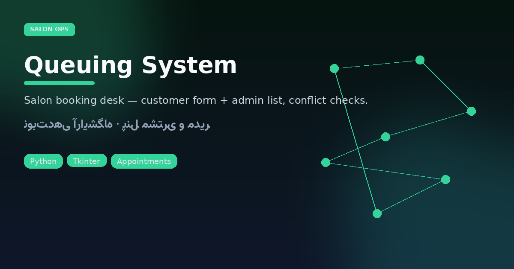

# Queuing System — سالن زیبایی

<p align="center"></p>

<p align="center">


</p>

Desktop appointment desk for a beauty salon: **customer booking form** + **admin list** with conflict detection — no database server required (in-memory list for the session).

## Operator flow

```
[Main] → Customer panel → name / service / date / time → validate → append
       → Admin panel    → listbox refresh · delete selected
```

Date format `YYYY-MM-DD`, time `HH:MM`. Duplicate timestamps are rejected.

```bash
python3 "نوبت دهی .py"
```

### Stack chips

Python · Tkinter · `datetime` parsing · messagebox UX

---

## فارسی — سیستم نوبت‌دهی آرایشگاه

اپلیکیشن دسکتاپ برای ثبت نوبت: مشتری نام، نوع خدمات، تاریخ و ساعت را وارد می‌کند؛ اگر همان تایم قبلاً رزرو شده باشد خطا می‌گیرد. مدیر از پنل جداگانه لیست نوبت‌ها را می‌بیند و می‌تواند حذف کند.

### ارزش برای سالن کوچک

| نیاز | پوشش |
|------|------|
| ثبت سریع نوبت | فرم مشتری |
| جلوگیری از تداخل | مقایسه timestamp |
| مرور روزانه | Listbox مدیر |
| بدون سرور | حافظهٔ جلسه جاری |

### اجرا

```bash
python3 "نوبت دهی .py"
```

> توجه: داده‌ها در حافظه نگه داشته می‌شوند؛ با بستن برنامه پاک می‌شوند. برای ماندگاری می‌توان لایهٔ SQLite اضافه کرد.
